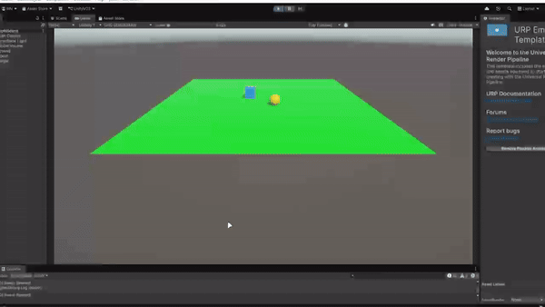
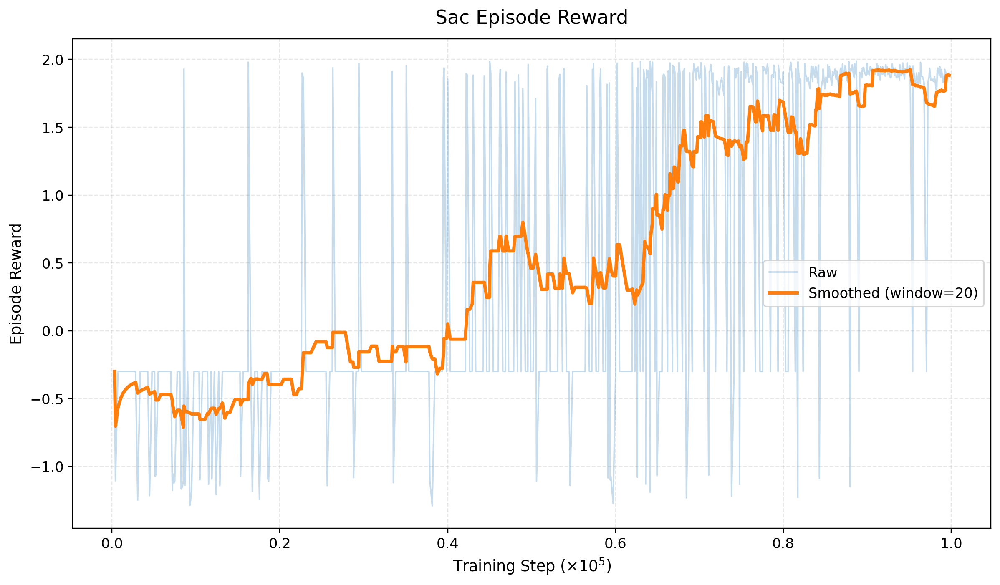
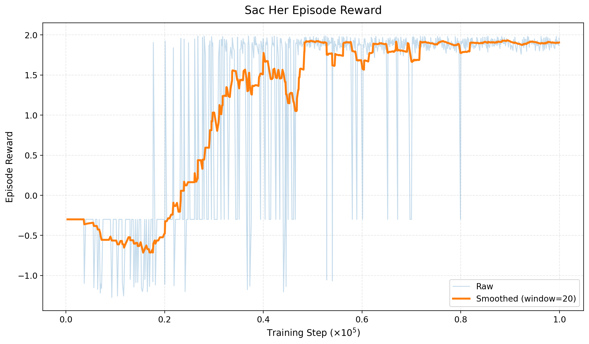
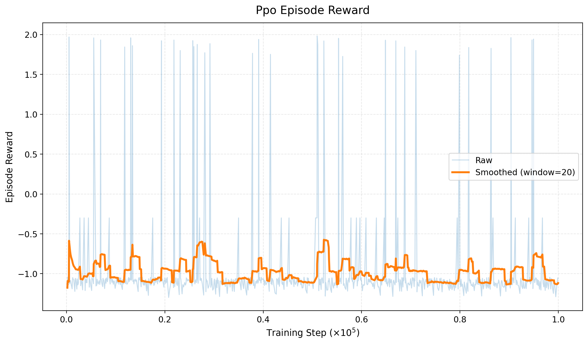
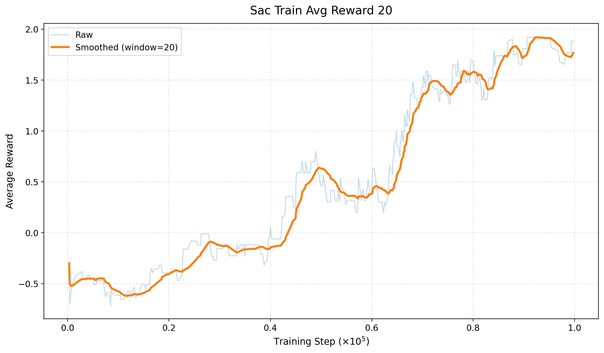
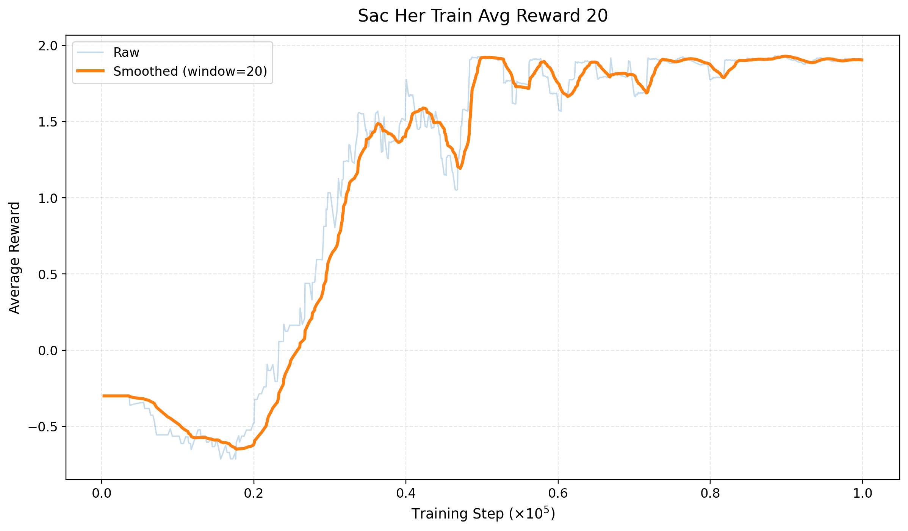
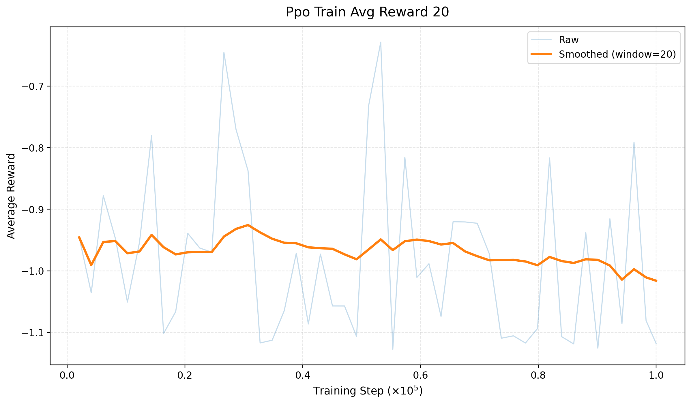

# A Simple 3D Reacher in Unity ML-Agents for Reinforcement Learning

This project builds a simple **3D reacher environment** in **Unity ML-Agents** and trains an agent with custom **PyTorch** implementations of:

- **PPO**
- **SAC**
- **SAC + HER**

The task is simple: an agent is spawned on a ground plane, a target is spawned at another random location, and the agent must learn to move toward and reach the target as efficiently as possible.

---

## Project Overview

This repository combines:

- a **Unity 3D environment**
- a **Python training pipeline**
- [ PyTorch ](https://pytorch.org/) implementations of:
  - PPO
  - SAC
  - SAC with Hindsight Experience Replay (HER)
- [TensorBoard](https://www.tensorflow.org/tensorboard/) logging
- plotting utilities for exported TensorBoard CSV files

This project is useful for learning:

- how to build a custom environment in Unity ML-Agents
- how to connect Unity with Python through `mlagents_envs`
- how to train RL agents with PyTorch
- how different RL algorithms behave on a sparse-reward goal-reaching task

---

## Environment Details

### Task

The environment is a simple **goal-reaching problem**:
- the **agent** starts at a random position on the ground
- the **target** starts at another random position
- the agent must move on the $XZ$ **plane**
- the episode ends when:
  - the agent reaches the target
  - the agent falls off the map
  - the maximum number of steps is reached

### Observation Space

The agent receives a **9-dimensional observation vector**:

- agent position `(x, y, z)`
- target position `(x, y, z)`
- relative position `(target - agent)` `(x, y, z)`

### Action Space

The agent uses a **2-dimensional continuous action space**:

- movement on the $X$ **axis**
- movement on the $Z$ **axis**

### Reward Design

This environment is mostly a **sparse-reward goal-reaching task** with a few penalties:

- `+2.0` when the agent reaches the target
- `-0.001` **small step penalty** every step to encourage faster solutions
- `-1` **large negative penalty** if the agent falls off the ground

Because the positive reward is only given when the target is reached, this setup is a good fit for **HER**, especially when combined with **SAC**.

---

## Repository Structure

```text
.
├── Assets/                 # Unity environment assets, scripts, scenes, materials
├── Packages/
├── ProjectSettings/
├── PythonScripts/
│   ├── agents/             # PPO and SAC agent implementations
│   ├── buffers/            # rollout buffer, replay buffer, HER replay buffer
│   ├── envs/               # Unity Python environment wrapper
│   ├── models/             # networks and actor-critic models
│   ├── tests/              # environment and training-related tests
│   ├── trainers/           # train_ppo.py, train_sac.py, train_sac_her.py
│   ├── utils/              # logger, plotter, helper tools
│   └── Images/
│       └── plots/
│           ├── csv/        # exported TensorBoard CSV files
│           └── *.png       # generated plots
└── README.md 
```

--- 

## Results
|     | Soft Actor-Critic (SAC) | SAC + Hindsight Experience Replay (HER) | Proximal Policy Optimization (PPO) | 
| --- | ------------------------| --------------------------------------- | -----------------------------------|
| Episode Reward |  |  |  |
| Train Avg Reward |  |  |  |
